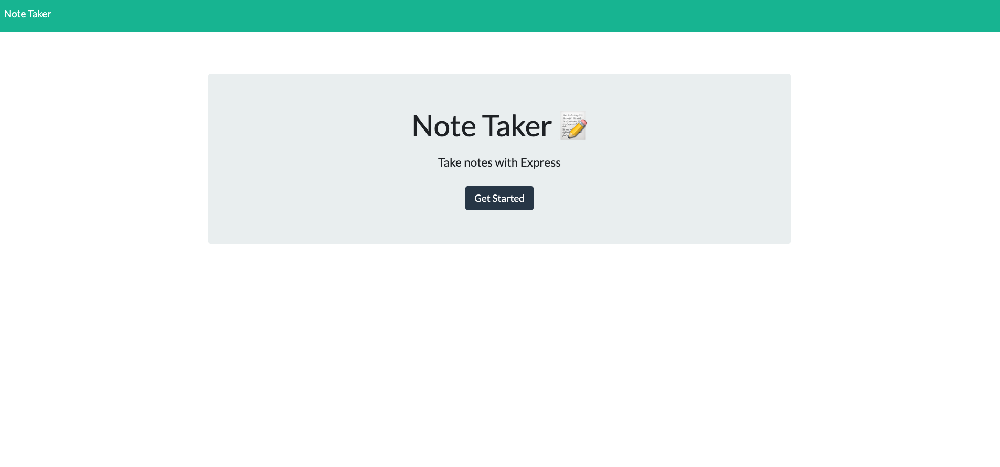

# Note Taker · 

  ## Description

  This is a web application, leveraging Express.js, that can be used to write, save, and delete notes.

  ## Screenshot of Note Taker
  
  
  
  ## Table of Contents
  
  * [Usage](#usage)
  * [License](#license)
  * [Questions](#questions)
  
  ## Usage 
  
  You can view the deployed application [here](https://express-note-taker-dp.herokuapp.com/).
  
  ## License
  
  CLI Team Generator is [MIT licensed](https://opensource.org/licenses/MIT).

  ## Questions

  Link to my [GitHub](https://github.com/dpan-5)
  
  If you have additional questions, you can reach me at: dpan5425@gmail.com
